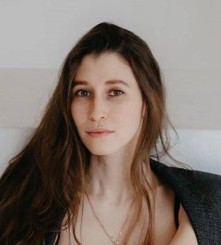

1. My fullname is Nalatia Zaripova
2. Contacts:

- Shayfutdinova1995@mail.ru
- https://github.com/DrNatalia
- https://t.me/drShaifutdinova
---

3. I have been working as a doctor for more than 4 years, specializing in allergist-immunologist. In my free time I enjoy programming. Lately, I have found programming to be a great pleasure for me, so I decided to change my field of activity. I hope my persistence will help me achieve heights in this area.
4. Skils:

- CSS
- HTML
- JS
- Git
---
5. *Example code:*
``` 
    
function countUser(arg_1, arg_2, arg_3){
    if(arg_3 === 1){
        let S = arg_1 * arg_2
        return S
    }
    else if(arg_3 === 2){
        let p = 2 * (arg_1 + arg_2)
        return p
    }
    else{
        return false
    }

}
console.log(countUser(width, length, choiceCount));

```
---
6. https://github.com/DrNatalia/rsschool-cv
7. I am a graduate of the Izhevsk State Medical Academy, also of the Kazan Federal University, majoring in allergology and immunology.
8. My level of English is A1, which is why I often have to resort to Google translator, and I also plan to study with a tutor.
